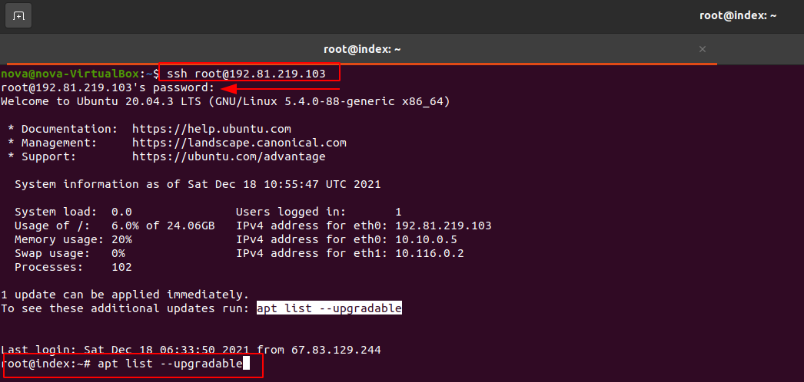

# Hosting a webserver using Nginx 

## Table of Contents
<!-- TOC -->
- [Hosting a webserver using Nginx](#hosting-a-webserver-using-nginx)
  - [Table of Contents](#table-of-contents)
  - [What is DigitalOcean?](#what-is-digitalocean)
  - [Why did I use DigitalOcean?](#why-did-i-use-digitalocean)
  - [First create an account in digitalOcean!](#first-create-an-account-in-digitalocean)
  - [Create a Droplet](#create-a-droplet)
  - [Start your Ubuntu terminal](#start-your-ubuntu-terminal)
  - [vi Text Editor](#vi-text-editor)
  - [Nginx Page](#nginx-page)
  - [Source Cited](#source-cited)

## What is DigitalOcean?
**DigitalOcean** is a cloud computing vendor that offers an Infrastructure as a Service (IaaS) platform for software developers. DigitalOcean is very popular with **open source developers** and competes with Amazon Web Services (AWS) and Google Compute Engine.

## Why did I use DigitalOcean?
I personally feel comfortable working with the droplets because I can choose the droplet's size, desired geographical region and data center it will run in, and which Linux operating system it will use such as: Ubuntu, CentOS, Debian, Fedora, CoreOS or FreeBSD. Secure Shell (SSH) is also supported for secure communication. Instead of picking a Linux distribution, developers can also create droplets from existing VM images that come with pre-installed applications. 
> **Droplet:** To deploy DigitalOcean's Infrastructure as a Service (IaaS) environment, developers launch a private virtual machine (VM) instance, which DigitalOcean calls a **"droplet"**.

## First create an account in digitalOcean!
To create an account you must proceed to this page [DigitalOcean](https://www.digitalocean.com/try/developer-brand?utm_campaign=amer_brand_kw_en_cpc&utm_adgroup=digitalocean_exact_exact&_keyword=digitalocean&_device=c&_adposition=&utm_content=conversion&utm_medium=cpc&utm_source=google&gclid=EAIaIQobChMIn_LY3YXt9AIVM8mUCR0Pkw_DEAAYASAAEgJG9vD_BwE) and follow the steps down below: 

- **Sign up** with your email and create password. 
  
    

- To verify your account you will receive a link in you email you used to . **Click** the link and you will be verified right away!
  
    

- It will ask you to provide your payment information. But don't worry! It is is 100% free for the first 60 days. *(As long as you disable the account before 60 days, you will not find any money deduction from your account.)*

    

## Create a Droplet

- Select the **Droplet** option for your first project. It will create a droplet form for you.

    
- First select <u>Ubuntu</u> as the **Distributions**, Choose <u>Basic</u> plan to create the **Plan**.
    
- Select <u>Regular Intel with SSD</u> for **CPU options**, then select the least amount of <u>plan</u> you will spend per month. *(Reminder: It does not charge money from your wallet)*
   
- Select which ever **Datacenter Region** is close to your location. You do not need to change the settings for **VPC Network** or **Additional options**. 
    
- For **Authentication** choose <u>Password</u> and proceed to insert the password according to the *requirements*. You only need 1 droplet for the **Quantity**. For a **Hostname** choose a meaningful name.*(This will be your droplet name)*
    
- After you choose a hostname, the Final step is to create the **droplet**. 
    

> The process might take up to 1 minute! So, allow the droplet to be created.

- After the Droplet is created, copy the **ip address** and open your **Oracle VM machine**.
    

## Start your Ubuntu terminal
- From your **Virtual Box** log into the server you created in **DigitalOcean**. Follow the command-line and insert the password which you used to create your **droplet**. You might get warnings to upgrade, so follow the command as it directs you.  
   - **ssh root@yourIpAddress** -> To log into your remote server
   - **apt list --upgradable** -> To upgrade if anything needs to update. 
  

- As you upgrade all the files, you need to install the **Nginx**. *(NGINX is open source software for web serving, reverse proxying, caching, load balancing, media streaming, and more.)*
    
    
        sudo apt install nginx -> Allows user to install Nginx to their remote server. 
    

- After installing nginx in your remote server, check the status of Nginx to verify.
        
        sudo systemctl status nginx -> To check the status of Nginx, whether it is active of inactive. 
  
    
- Get inside of the folder */var/www/html/* and edit the default file *"index.nginx-debian.html"* with vi editor.
  
        cd /var/www/html/ -> It allows user to change directory *(in this case to the var/www/html/)*

        ls -> To list all the files *(in this case inside of the /var/www/html/)*

        vi index.nginx-debian.html -> To edit the html file *(it is an editor and it will edit the index.nginx-debian.html file)*

    
- After you open the html file you open with an editor. Start editing the way you want your webpage to look like! The **vi** editor requires specific key control. 

## vi Text Editor
  > What is vi editor? The vi editor is the most popular and commonly used Unix text editor. It is usually available in all Linux Distributions. It works in two modes, Command and Insert. Command mode takes the user commands, and the Insert mode is for editing text.

        i -> To insert any character
        a –> Write after cursor (goes into insert mode)
        A –> Write at the end of line (goes into insert mode)
        ESC –> Terminate insert mode
        u –> Undo last change
        U –> Undo all changes to the entire line
        o –> Open a new line (goes into insert mode)
        dd –> Delete line
        3dd –> Delete 3 lines.
        D –> Delete contents of line after the cursor
        C –> Delete contents of a line after the cursor and insert new text. Press ESC key to end insertion.
        dw –> Delete word
        4dw –> Delete 4 words
        cw –> Change word
        x –> Delete character at the cursor
        r –> Replace character
        R –> Overwrite characters from cursor onward
        s –> Substitute one character under cursor continue to insert
        S –> Substitute entire line and begin to insert at the beginning of the line
        ~ –> Change case of individual character

- You should be in the **command mode** to execute these commands. VI editor is case-sensitive so make sure you type the commands in the right letter-case.

    - Make sure you press the right command otherwise you will end up making undesirable changes to the file. You can also enter the insert mode by pressing a, A, o, as required.

**Moving within a file**

    k –> Move cursor up
    j –> Move cursor down
    h –> Move cursor left
    l –> Move cursor right

  - You need to be in the command mode to move within a file. The default keys for navigation are mentioned below else; You can also use the arrow keys on the keyboard.
  
**Saving and Closing the file**

    Shift+zz –> Save the file and quit
    :w –> Save the file but keep it open
    :q –> Quit without saving
    :wq –> Save the file and quit
    

- Start or Restart your nginx to run as a webpage. 

        sudo systemctl start nginx -> Starts nginx
        sudo systemctl stop nginx -> Stops nginx
        sudo systemctl restart nginx -> Restarts nginx
        sudo systemctl enable nginx -> Enables nginx
 
    

- The Last step is to copy your remote server ip address and search it any search engine. 
    - [Google](https://www.google.com/) 
    - [Microsoft Edge](https://www.microsoft.com/en-us/edge?browser=Chrome&FORM=MG0AU2&r=1)
    - [Mozilla Firefox](https://www.mozilla.org/en-US/firefox/)
  
- Once you search your **IP address**, your webpage should be visible to  you and the people who has access to the remote server's IP address.

## Nginx Page

**Congratulations! you have successfully accomplished to host a webpage using Nginx!!**

## Source Cited
**[Source1](https://www.guru99.com/the-vi-editor.html)**
**[Source2](https://searchcloudcomputing.techtarget.com/definition/DigitalOcean)**
**[Source3](https://www.nginx.com/resources/glossary/nginx/)**

    
