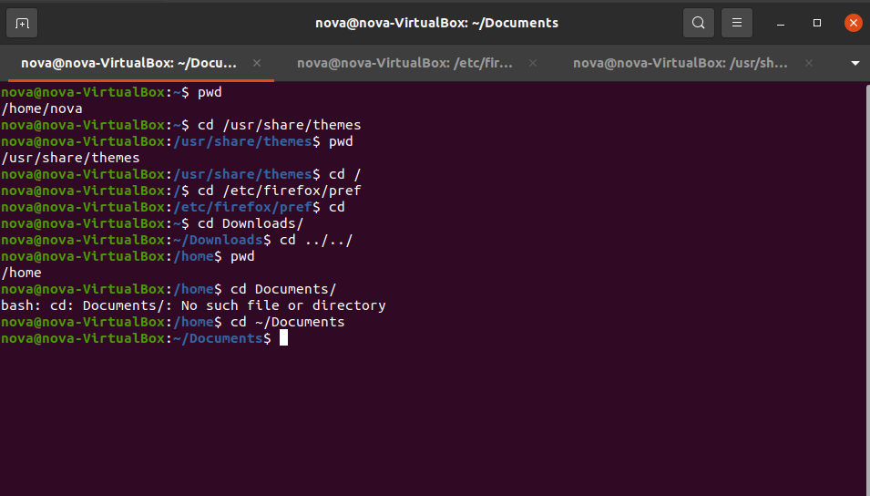

# Lab 3 | Installing software and navigating the file system | Answers
Assignment description [here](https://raw.githubusercontent.com/ra559/cis106/main/labs/lab3.md)

## Question 1
1. Which command did you use to search for the themes and to install them?
To find: apt search theme
To install; sudo apt install breeze-gtk-theme

2. Which commands did you use to find and install the web browser?
To search: apt search web browser
To install: sudo apt install surf

3.1 What is the name of the package?
Ans: surf
    
3.2 What dependencies are needed in order to install the package? (you can either take a screenshot of the terminal or copy and paste from the terminal)
libc6 (>= 2.4), libgcr-base-3-1 (>= 3.8.0), libgcr-ui-3-1 (>= 3.8.0), libglib2.0-0 (>= 2.28.0), libgtk-3-0 (>= 3.19.12), libwebkit2gtk-4.0-37 (>= 2.15.1), libx11-6

3.3 How much disk space will the package utilize after installation?
114 kb
 

## Question 2
(

## Question 3

## Question 4

## Question 5

